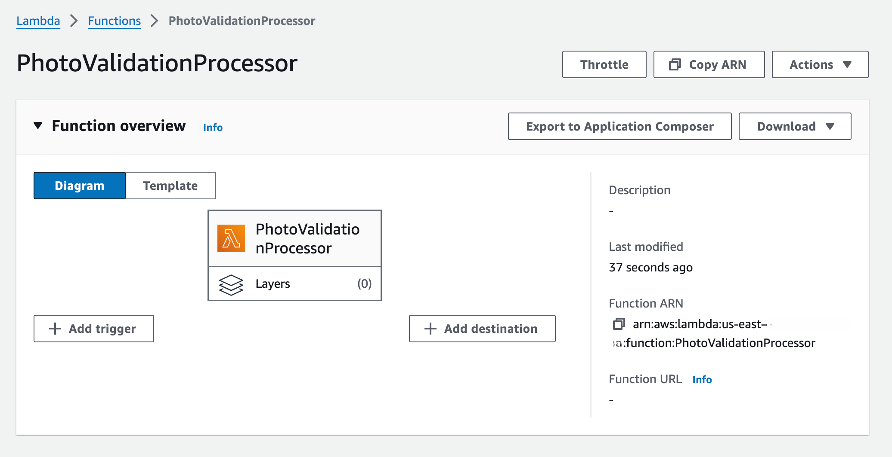
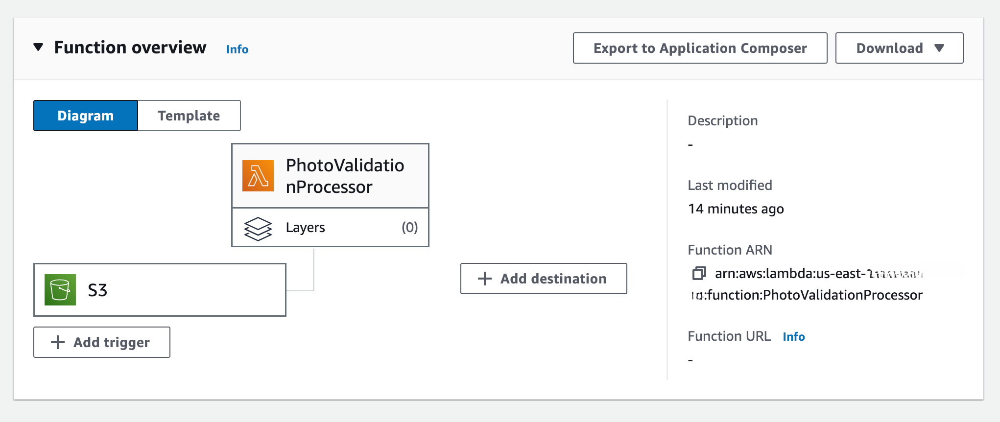
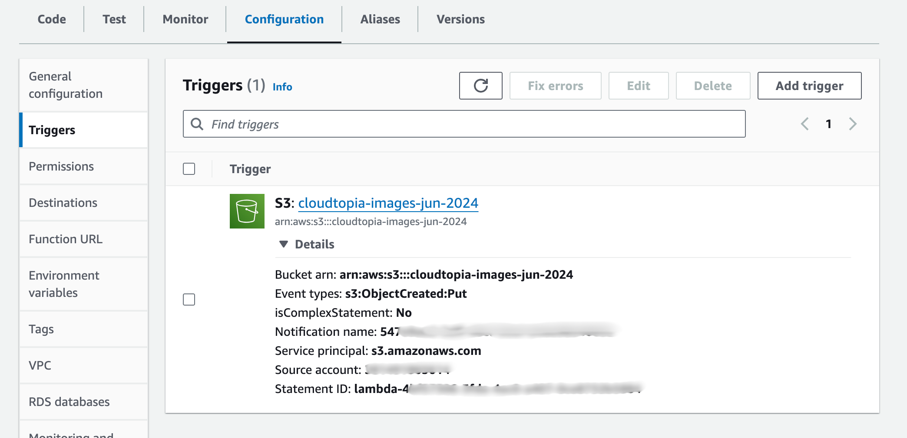
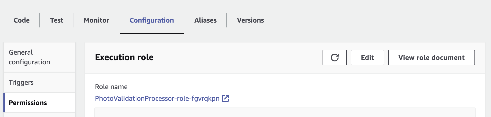

## S3 Triggers: Automating Image Processing for the Cloudtopia Passport Office Automation Project

To automate the image processing workflow, I will use a feature of S3 called Triggers. S3 Triggers allow you to notify other AWS services when a file gets created, modified, or deleted. For this project, I am interested in using the PUT notification type, which corresponds to file uploads.

When S3 triggers the Lambda function, it will provide the S3 bucket and file details of the uploaded file in the event arguments. This information will be used to interact with Amazon Rekognition, enabling the automated evaluation of passport photos. As you proceed through the following steps, you'll see how S3 Triggers seamlessly integrate with other AWS services to streamline the photo validation process.

### Step 1: Create an s3 Bucket with a Lambda Trigger

* click `Create bucket`
* Type in a global name
* Leave all the default settings
* Click `Create Bucket`

* Go to Lambda 
* Click `Create Function`
* Type a name for the function
* Change the language to Python 3.12 under `Runtime`
* Leave all the default settings
* Click `Create function`

Once the function is created and you see the PhotoValidationProcessor function overview:

* Click `Add Trigger`
* Add s3 in the `Select a source` dropdown
* Select the `CloudTopia-Images` bucket that was created
* Leave all the other options as default
* Check the box under `Recursive invocations`
* Click `Add`

You will then see the creation of the trigger reflected in the function overview:

This Lambda trigger is configured to respond to new file uploads in the S3 bucket `cloudtopia-images-jun-2024`. It activates on `s3:ObjectCreated:Put` events, meaning the associated Lambda function will execute whenever a new object is added to the bucket. This enables automatic processing of files immediately upon upload and then the system can efficiently handle incoming passport photos without manual intervention.

S3 now has the permission to invoke the Lambda function but to be able to read the data, additional permissions are needed. These permissions need to be added separately via IAM. 

* Click `Permissions`
* Click the link under `Role name`

