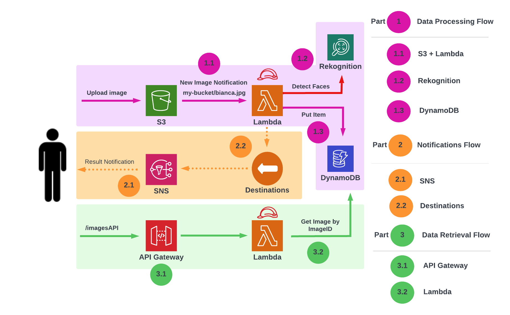

# Cloudtopia Passport Office Automation Project

## Introducing the Cloudtopia Passport Office Automation Project: Enhancing Passport Photo Validation with Robust Architecture

### Project Overview

Traditionally, citizens applying for passports faced a manual evaluation process for submitted photographs, with strict adherence to guidelines. My project not only automates this process but also fulfills crucial architectural requirements to ensure efficiency, scalability, and reliability.

### Introduction

As an employee of the Cloudtopia Passport Office—a Federal agency responsible for issuing passports to the fine citizens of Cloudtopia—I am tasked with simplifying the Passport Photo Validation process using automation.

Currently, citizens of Cloudtopia who wish to apply for a passport must submit a photograph of themselves. For the photograph to be accepted, it must adhere to strict requirements: the applicant's face must be clearly visible, they must not be wearing sunglasses, their eyes must be open, and they must not be smiling.

For example:
- An image with the applicant’s eyes closed would fail the evaluation process.
- An image with the applicant smiling would also fail.
- An image adhering to all guidelines would be accepted.

In the current Photo Validation process, applicants submit their photographs through a web endpoint. An agency employee then evaluates the image to ensure it adheres to guidelines and either accepts or rejects it, providing a reason for rejection if necessary.

The Cloudtopia Passport Office has three main requirements for this project:

1. **Automation**: Remove the need for a human to evaluate submitted photographs.
2. **Notifications**: Broadcast notifications to other services within Cloudtopia whenever a photo evaluation is completed.
3. **API Access**: Provide a means to access the result of the photo evaluation through an API, detailing any reasons for rejection.

By automating the photo validation process, I aim to streamline passport issuance, reduce human error, and improve overall efficiency.

---

### Core Technology Choices: Powering the Cloudtopia Passport Office Automation Project

In the pursuit of an efficient and scalable solution, I have carefully selected core technologies that seamlessly integrate to deliver a robust Passport Photo Validation system.

### Image Processing ###
**Technology Stack: S3, Lambda, Amazon Rekognition, DynamoDB**

For image processing, I use Amazon S3 to store image files. Upon upload, the system triggers a Lambda function. The Lambda function code calls Amazon Rekognition to evaluate the face in the image, and the results are stored in DynamoDB. This ensures a performant and scalable key-value lookup store for approval/rejection details.

### Notifications ###
**Technology Stack: Lambda, Lambda Destinations, SNS (Simple Notification Service)**

For notifications, I leverage a feature of Lambda called Lambda Destinations, which allows piping the results of a Lambda function invocation to another AWS service. In this case, the results are delivered to the SNS (Simple Notification Service) topic. This ensures timely and efficient delivery of messages to client services, promoting a decoupled and resilient microservices architecture.

### Data Retrieval ###
**Technology Stack: API Gateway, Lambda, DynamoDB**

For data retrieval, I create an API Gateway endpoint that is hooked up to a Lambda function. This Lambda function queries the DynamoDB database, allowing for swift and accurate retrieval of information related to image evaluations. This cohesive integration ensures a user-friendly API interface for external systems, promoting transparency and accessibility.

By combining these core technologies, my architecture not only fulfills the unique requirements of each project phase but also ensures a cohesive and streamlined workflow. As you delve into the GitHub repository, witness the synergy of S3, Lambda, Amazon Rekognition, DynamoDB, Lambda Destinations, SNS, API Gateway, and more, contributing to the success of the Cloudtopia Passport Office Automation Project.

---
